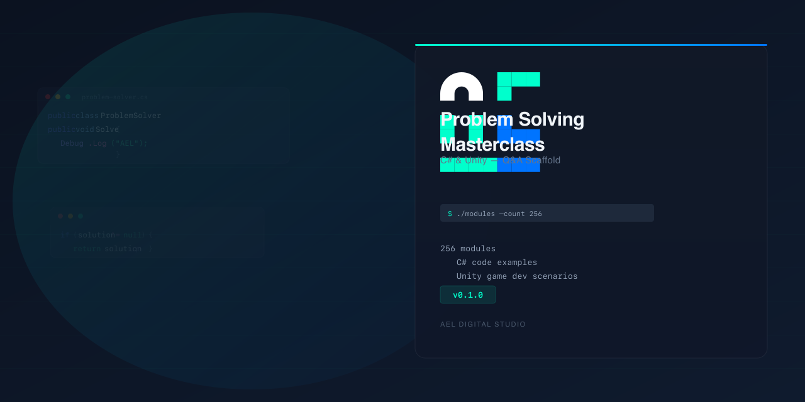

# AEL Academy — Problem Solving Masterclass (Scaffold)



**Version:** 0.1.0 — Pre-release

An interactive, zero-dependency Q&A browser for C# and Unity game development problem-solving scenarios. Built with vanilla HTML, CSS, and JavaScript.

---

## Overview

This project is a static single-page application that renders 256 problem-solving modules from a local data file. It provides search, filtering by difficulty and type, bookmarking, and deep linking.

**Important:** The dataset is synthetically generated as a structural scaffold. All answers, explanations, and code examples are boilerplate placeholder text. This project demonstrates the engine's rendering and filtering capabilities — it is not a curated educational resource. See [CHANGELOG](./CHANGELOG.md) for the current release status.

---

## Features

- 256 problem-solving modules with expand/collapse cards
- Keyword search across modules
- Filter by difficulty and question type
- Bookmark modules (persisted via localStorage)
- URL hash-based deep linking
- Dark-mode glassmorphism UI
- Zero dependencies — no build tools, no server required

---

## Quick Start

```bash
git clone <repo-url>
cd problem-solving-academy
open index.html
```

Works in any modern browser. No installation required.

---

## Project Structure

```
problem-solving-academy/
├── index.html              # Main HTML file
├── styles.css              # All styles (dark theme, glassmorphism)
├── app.js                  # Application logic (render, search, filter, bookmark)
├── data.js                 # Module dataset (256 records)
├── generate_course.js      # Node.js script used to generate the dataset
├── ael-logo.svg            # AEL brand logo
├── README.md
├── LICENSE                 # MIT
├── CHANGELOG.md
└── .gitignore
```

---

## Data

- **Format:** JSON-style array of objects with fields: id, question, detailedAnswer, difficulty, type, tags, relationships, and more.
- **Count:** 256 records.
- **Generator:** `generate_course.js` produces the dataset from a topic list template.
- **Note:** All content is synthetically generated placeholder text. Answers and explanations are identical boilerplate across all modules.

---

## Generating Data

```bash
node generate_course.js
```

This will overwrite `data.js`. The script uses CommonJS `require('fs')` and runs in Node.js.

---

## Known Limitations

- The UI caps displayed results at 100 cards — modules 101–256 are not reachable through browsing without filtering.
- 3 data fields (`relatedConcepts`, `relatedReferences`, `interviewRelevance`) are not rendered in the current UI.
- The "Interview" difficulty filter option exists in the UI but no data records match it.

---

## License

MIT — see [LICENSE](./LICENSE).

---

## Author

**Ayman Elmasry** — AEL Digital Studio
